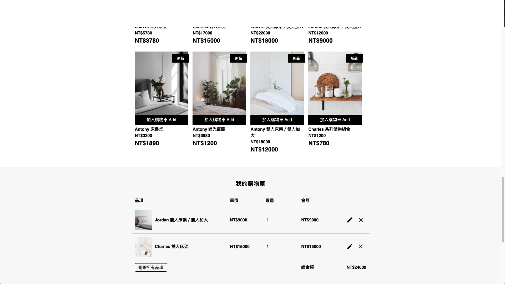
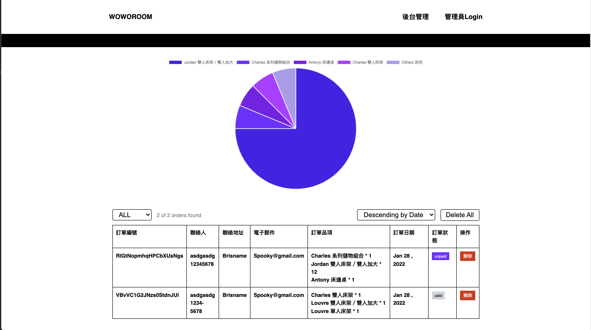

# Woworoom-ecommerce website

###### tags: `Hexschool` `六角學院` `RESTful API` `FronEnd Challenge`

This is a solution to the [woworoom-ecommerce](https://xd.adobe.com/view/a48b8617-4588-4817-9062-b62130dce916-f1d8/) designed by Hexschool, and RESTfuls APIs are provided by the school as well.

- Live Demo:https://greatmetis.github.io/woworoom-ecommerce

## Table of contents

- [Overview](#overview)
  - [The challenge](#the-challenge)
  - [Screenshot](#screenshot)
  - [Links](#links)
- [My process](#my-process)
  - [Built with](#built-with)
  - [What I learned](#what-i-learned)
  - [Continued development](#continued-development)
  - [Useful resources](#useful-resources)
- [Author](#author)
- [Acknowledgments](#acknowledgments)

## Overview

### The challenge

Users should be able to:

- View the optimal layout for each page depending on their device's screen size
- See hover states for all interactive elements on the page
- Interact with the shopping cart in the home page and order list in the admin page(add/edit/delete)
- Filter displayed products as well as order list on the admin page
- Send Orders and see the results in the order list
- See errors if the order form is not entered correctly
- See popup info when selecting elements. ie. see alert when the user is trying to delete all items in the shopping cart.

### Screenshot





## My process

### Built with

- Vue - JS library
- Vue Router
- Vuex - Vue state management
- Chart.js - to draw pie chart in Admin Page
- axios - to fetch RESTful APIs

### What I learned

I intended to use Vuex, the state management, is this project. This allows me to share data across the application.
To create a clean state tree, I divided my store into modules, and every module has there own state, mutations and actions.
Binding helpers like `mapState`, `mapActions` etc are used in vue files.

```js
// store/index.js

const cart = {...}
const products = {...}
const admin = {...}
const store = createStore({
  modules:{
    cart,
    products,
    admin
  },
})
export default store
```

Another takeway from the project is to intergrate async/await with loading status on admin page. This makes my site load smoothly and more reactive.

I use `loading` to control if showing loading icon instead of empty page, and call the following function when I need to wait the response from API.

```js
// views/Admin.vue
async loadOrders(){
  this.loading = true
  await this.fetch_order()
  this.countOrderData()
  this.loading = false
}
```

### Continued development

- I would like to be more familiar with building charts with chart.js, and thinking to create dynamic charts to show revenue become a realistic ecommerce dashboard.

## Author

- Frontend Mentor - [@greatmetis](https://www.frontendmentor.io/profile/@greatmetis)
- LinkedIn - [Chao-Chen(Metsi) Teng](https://www.linkedin.com/in/chao-chen-metis-teng-614633123/)
